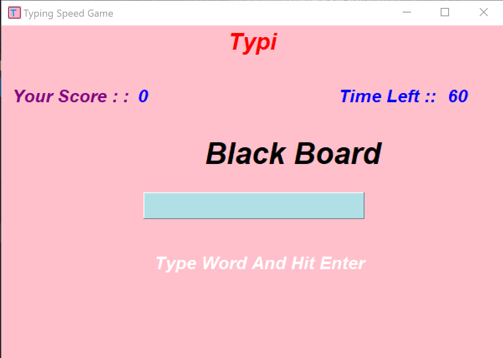

# Speed-Typing-Game



# Speed Typing Game in Python

Speed Typing Game in Python is a typing game designed to help users improve their typing speed and accuracy. Created by Manish Parihar, this game is built using Python and utilizes the pygame module to create an engaging user interface.

## Features

- Interactive user interface
- Different levels of difficulty based on word length and complexity
- Adjustable time limit for each level
- Tracks user's accuracy and typing speed
- Option to save user's high scores

## How to Play

The game consists of a text field where users are prompted to type in a given word or phrase as quickly and accurately as possible. The objective of the game is to type as many words as possible within a given time limit.

To start playing, simply run the Python file and follow the instructions on the screen. The game will prompt the user to select a difficulty level and set a time limit. The user will then be presented with a series of words to type. The game will track the user's accuracy and typing speed and display the results at the end of each level.

## Dependencies

- Python 3.x
- pygame module

## Installation

To install the pygame module, run the following command:

```
pip install pygame
```

## License

This project is licensed under the MIT License - see the LICENSE file for details.
